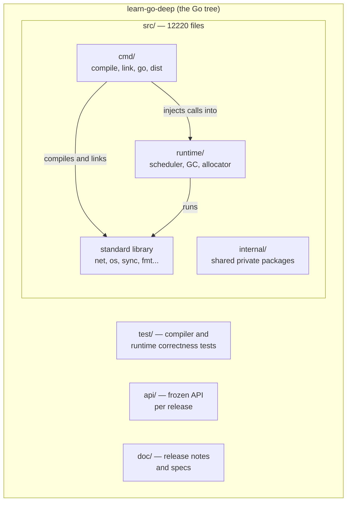
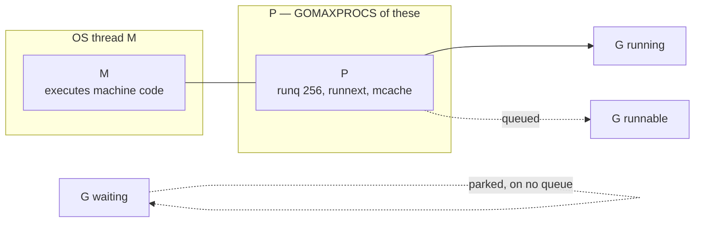
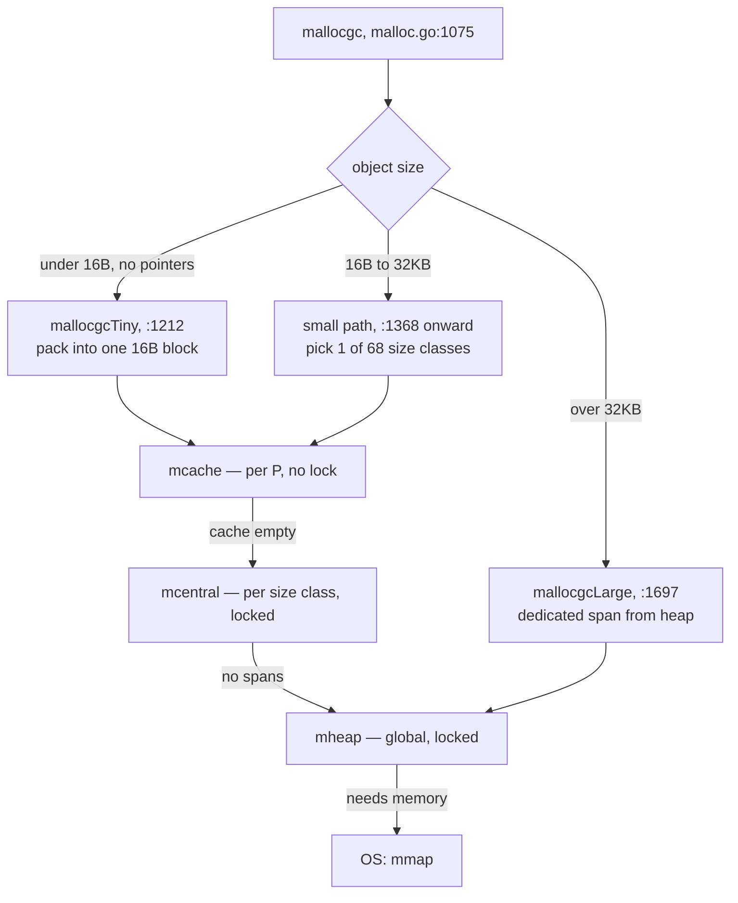
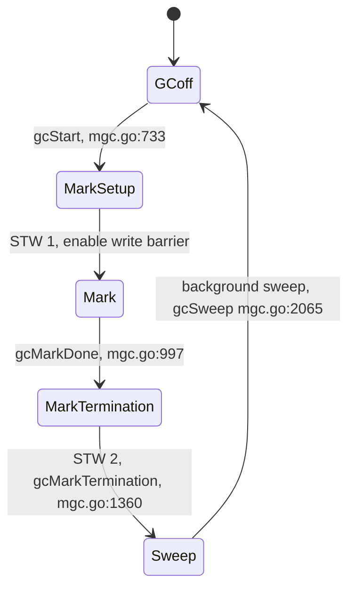
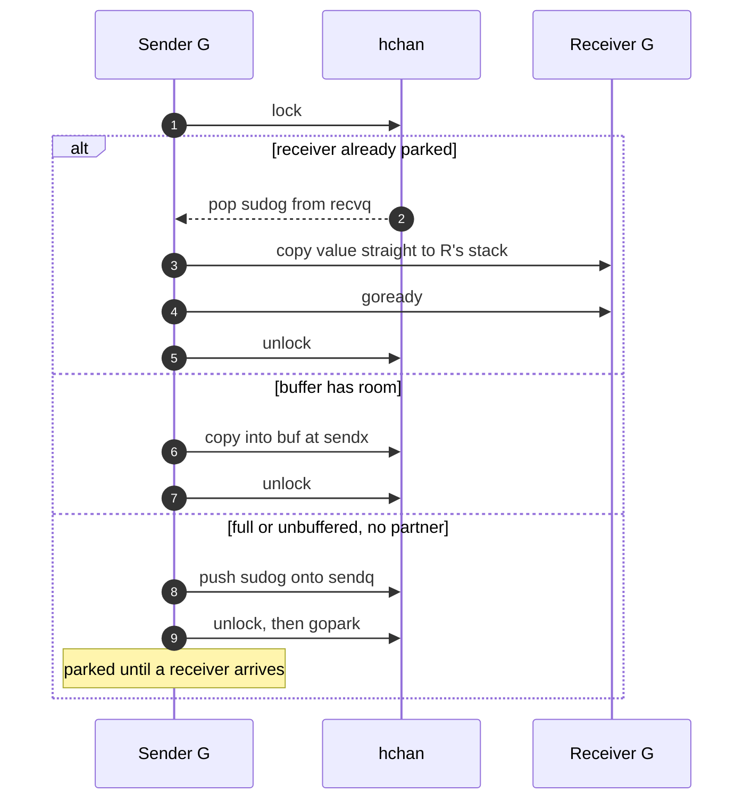
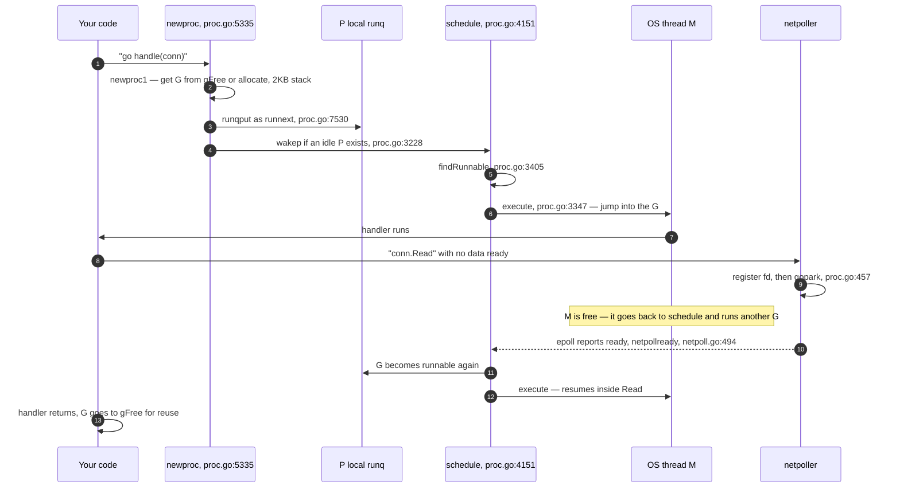

# The Go Source Tree — How to Study Go's Internals from `learn-go-deep`

**Repository:** `github.com/phankieuphu/learn-go-deep`
**What it actually is:** a fork of `golang/go` — the Go language, runtime, standard library, and toolchain
**Version covered:** Go 1.28 development tip (`src/internal/goversion/goversion.go` → `Version = 28`)
**Commit read:** `bddf824b` ("cmd/go: disable early export on plan9"), dated 2026-09-13
**Scope:** the runtime — scheduler, memory allocator, garbage collector, channels, stacks, netpoller — plus a map of the whole tree and how to build and experiment with it
**Out of scope:** the compiler's SSA backend in depth, the linker, cgo, `crypto` internals, and architecture-specific assembly. Section 16 points you at those.
**Last verified:** 2026-09-14

> **Note on what you cloned.** There are no custom commits in this fork — every commit in the history is
> upstream Go. So this guide treats it as what it is: a personal copy of the Go source tree for study.
> That is a good way to learn Go deeply, and the rest of this document is built around it.

---

## 1. What problem it solves

Before Go, a server engineer had two bad options for concurrency. **OS threads** are simple to reason
about but expensive: each one costs a megabyte or more of stack, and a context switch goes through the
kernel. You cannot have a million of them. **Event loops with callbacks** (epoll, Node-style) are cheap
but they invert your code — logic gets shredded into callbacks, and any accidental blocking call stalls
the whole loop.

Go's bet was that you can have both. Write code in the straightforward blocking style, but make the thing
that blocks cheap: a **goroutine** starts with a 2 KB stack (`src/runtime/stack.go:78`, `stackMin = 2048`)
that grows on demand, and blocking a goroutine parks it in user space instead of trapping into the kernel.
A scheduler inside the Go runtime multiplexes many goroutines onto a few OS threads, and the netpoller
turns blocking I/O into epoll events behind your back.

The cost of that bet is the rest of this document. The runtime must now own scheduling, memory, and
garbage collection, which means there is a large, opinionated C-like Go program running under your
program at all times. When performance surprises you in production, the surprise almost always comes
from there.

> **Mental model:** Go is a language with an operating system inside it. `src/runtime/` is that operating
> system — it has a scheduler, a memory allocator, a page manager, and a collector, all cooperating with
> code the compiler injects into your functions.

That last clause matters and is easy to miss: the runtime is not a library that your program calls. The
compiler rewrites your code to call it. `go f()` becomes `runtime.newproc`. A stack-growth check is
prepended to most functions. A pointer write during GC becomes a write barrier. The runtime and the
compiler are one system, which is why they live in one repository.

---

## 2. Key terms

| Term                                | Meaning in one line                                                         | Why it matters                                                                      |
| ----------------------------------- | --------------------------------------------------------------------------- | ----------------------------------------------------------------------------------- |
| **G**                               | A goroutine — its stack, program counter, and status (`runtime2.go:471`)    | The unit you create with `go`; cheap because it is just a struct plus a small stack |
| **M**                               | An OS thread, "machine" (`runtime2.go:616`)                                 | Real kernel concurrency happens here; blocked syscalls block an M, not a G          |
| **P**                               | A processor — the right to run Go code (`runtime2.go:774`)                  | `GOMAXPROCS` is the count of P's; a P holds the local run queue and allocator cache |
| **`runnext`**                       | A one-slot fast lane on each P (`runtime2.go:820`)                          | Makes ping-pong patterns (channel send then receive) fast by skipping the queue     |
| **Local run queue**                 | 256-entry ring buffer per P (`runtime2.go:807`, `runq [256]guintptr`)       | Lock-free in the common case; the source of work-stealing behaviour                 |
| **Work stealing**                   | An idle P takes goroutines from a busy P (`proc.go:7782`, `runqsteal`)      | How Go keeps cores busy without a central lock                                      |
| **`gopark` / `goready`**            | Park a G off-thread / make it runnable again (`proc.go:457`, `proc.go:493`) | The primitive under every block — channels, mutexes, network I/O, `time.Sleep`      |
| **Netpoller**                       | epoll/kqueue integration inside the runtime (`src/runtime/netpoll.go`)      | Why a blocking `conn.Read` does not cost you a thread                               |
| **`sysmon`**                        | A background thread outside the scheduler (`proc.go:6538`)                  | Preempts long-running G's, retakes P's from syscalls, forces GC                     |
| **Async preemption**                | Signal-based interruption of a running G (`signal_unix.go:369`, `preemptM`) | Since Go 1.14, a tight loop with no function calls can still be stopped             |
| **`mcache` / `mcentral` / `mheap`** | Per-P, per-size-class, and global allocator layers                          | Most allocations never take a lock; the ones that do are the slow path              |
| **Size class**                      | One of 68 fixed object sizes (`internal/runtime/gc/sizeclasses.go:90`)      | Explains memory waste: a 33-byte object occupies 48 bytes                           |
| **Write barrier**                   | Compiler-inserted hook on pointer writes during GC (`mwbbuf.go:166`)        | The reason concurrent marking is correct, and a real cost on write-heavy code       |
| **STW**                             | Stop-the-world — all goroutines paused                                      | Go has two short STW pauses per GC cycle, not one long one                          |
| **GOGC / GOMEMLIMIT**               | Heap growth target / soft memory ceiling (`mgcpacer.go`)                    | The two knobs that decide how often GC runs and how much RAM you use                |

---

## 3. Architecture at a glance

The repository has four parts worth knowing. Almost everything you want is in `src/`.



Three things to take from this map.

`src/cmd/compile` and `src/runtime` are **one system split across two directories**. The compiler decides
where to insert stack checks, write barriers, and preemption points; the runtime provides the functions
those insertions call. Reading one without the other leaves gaps.

`api/` is a machine-checked promise. Each `api/go1.N.txt` lists every exported symbol added in that
release, and a test fails if the tree exports something not listed. This is the Go 1 compatibility
guarantee, made mechanical. `api/go1.27.txt` exists here and `goversion.Version` is 28, which tells you
this tree sits after the 1.27 freeze and during 1.28 development.

`test/` is not the standard library's unit tests — those live beside their packages as `*_test.go`. The
top-level `test/` directory holds compiler and runtime correctness cases, many with expected-output
`.golden` files, run by a custom harness.

---

## 4. Internals, component by component

### 4.1 The scheduler: G, M, P

The scheduler's job is to keep `GOMAXPROCS` threads doing useful Go work. It does that with three structs
in `src/runtime/runtime2.go`.

A **G** (`:471`) is a goroutine: a `gobuf` holding saved registers (`:303`), stack bounds, a status, and
bookkeeping. Creating one is a struct allocation plus a 2 KB stack — often recycled from the P's `gFree`
list (`runtime2.go:823`), which is why goroutine creation is measured in tens of nanoseconds.

An **M** (`:616`) is an OS thread. M's are created as needed and can outnumber P's, because an M blocked
in a syscall still exists but holds no P.

A **P** (`:774`) is the permission to execute Go code, plus the caches that make execution fast: the local
run queue, the `mcache` allocator cache, timers, and a deferred-object pool. `GOMAXPROCS` is exactly the
number of P's. The reason a P exists at all — rather than putting queues on the M — is that it lets the
runtime hand the queues and caches from a blocking thread to a fresh one without moving any memory.

The three combine into a triangle, and the interesting behaviour is what happens when one leg breaks:



**The scheduling loop.** `schedule()` (`proc.go:4151`) never returns — it finds a G and jumps into it via
`execute()` (`proc.go:3347`). The finding happens in `findRunnable()` (`proc.go:3405`), and its order of
preference is the scheduler's whole personality:

1. **Every 61st tick, check the global queue first** (`proc.go:3459`, `pp.schedtick%61 == 0`). This odd
   constant is a starvation fix. Without it, two goroutines that keep readying each other through
   `runnext` could monopolise a P forever and goroutines on the global queue would never run. A prime
   number avoids accidental resonance with other periodic behaviour.
2. **The P's own `runnext` slot, then its local run queue.** No lock in the common case, because only the
   owning P pushes to the head.
3. **The global run queue** (`schedt.runq`, `runtime2.go:960`), under a lock.
4. **The netpoller**, non-blocking — any goroutines whose I/O completed become runnable.
5. **Steal from another P** (`runqsteal`, `proc.go:7782`), taking half its queue, with randomised start
   order so all P's do not hammer the same victim.
6. Give up the P and park the M (`stopm`, `proc.go:3008`).

Work stealing is what makes Go's scheduler scale without a global lock on the hot path. The cost is that
scheduling is *not* fair in the strict sense, and goroutine execution order is genuinely unpredictable —
which is correct behaviour to rely on never.

**Preemption.** Two mechanisms, and the difference matters in production:

- *Cooperative:* the compiler puts a stack-growth check at the top of most functions. If a preemption flag
  is set, that check diverts into the scheduler. Cheap, but useless inside a loop that calls nothing.
- *Asynchronous:* `sysmon` notices a G has run for more than `forcePreemptNS = 10ms`
  (`proc.go:6680`) and sends a signal to its thread (`preemptM`, `signal_unix.go:369`). The signal handler
  redirects the thread into `asyncPreempt` (`preempt.go:305`), which saves registers and enters the
  scheduler.

Before Go 1.14 only the first existed, and `for {}` could hang a whole program at GC time. This is worth
knowing because it explains why GC pause behaviour improved sharply in that era.

**`sysmon`** (`proc.go:6538`) runs on its own thread with no P, sleeping between 20 microseconds and
10 milliseconds. It retakes P's from goroutines stuck in syscalls (`proc.go:6647`), preempts long-runners,
and forces a GC if none has run in two minutes. It also now updates `GOMAXPROCS` at runtime
(`sysmonUpdateGOMAXPROCS`, `proc.go:7174`), which is how recent Go versions notice a changed container CPU
limit — see `src/runtime/cgroup_linux.go`. For anyone running Go on ECS or Kubernetes, that file is worth
ten minutes: it is the difference between `GOMAXPROCS` matching your CPU quota and matching the host's
core count.

### 4.2 Memory allocator

Go's allocator is a thread-caching allocator in the tradition of tcmalloc, with three layers. The design
goal is that the common case takes no lock at all.



The **mcache** hangs off the P, so allocation from it needs no atomic operation — the P is already owned
exclusively by the running M. When it runs dry, the P refills from the **mcentral** for that size class,
taking a lock. When that is empty too, the **mheap** carves new spans, and beyond that the runtime asks
the OS.

**Size classes** are the part with visible consequences. There are 68 of them
(`internal/runtime/gc/sizeclasses.go:90`), running 8, 16, 24, 32, 48, 64, 80 ... up to
`MaxSmallSize = 32768`. Every allocation rounds up to a class, so a 33-byte struct takes 48 bytes and
wastes 15. The generated table in that file even documents the worst-case waste per class — class 5
(48 bytes) can waste 31.5%. This is why shrinking a struct from 33 to 32 bytes can cut real memory by a
third, and why `unsafe.Sizeof` plus this table beats guessing.

Objects under `TinySize = 16` bytes with no pointers get packed together into a single 16-byte block
(`mallocgcTiny`, `malloc.go:1212`). Small string and `[]byte` fragments are the intended beneficiaries.

### 4.3 Garbage collector

Go uses a **concurrent mark-and-sweep** collector with a **tricolour** abstraction and no compaction. The
phases are enumerated at `mgc.go:251`:



Marking runs **concurrently** with your program on dedicated worker goroutines (`gcBgMarkWorker`,
`mgc.go:1766`), targeting 25% of CPU. The two stop-the-world pauses are short — setup and termination —
which is why Go advertises sub-millisecond pauses while still collecting a large heap.

Concurrency creates a correctness problem: your program can move a pointer while the collector is
scanning, hiding a live object behind an already-scanned one. The fix is the **write barrier**. During the
mark phase the compiler routes pointer writes through a buffer (`mwbbuf.go:166`, `wbBufFlush`) that keeps
the collector informed. So a pointer assignment is not always one instruction — during GC it costs more.
Pointer-heavy data structures pay this tax; `[]byte` and pointer-free structs do not.

**No compaction** is a deliberate trade. It keeps the collector simpler and makes cgo and `unsafe` viable,
since object addresses never change. The price is fragmentation: freed memory returns to spans that may
not be reusable for a different size class, so RSS can stay high after a burst.

**Pacing** decides *when* to collect (`mgcpacer.go`). `GOGC` sets a target: at the default 100, the heap
may grow to twice the live size before the next cycle. `GOMEMLIMIT` sets a soft ceiling and makes the
pacer collect harder as you approach it (`heapGoalInternal`, `mgcpacer.go:1000`; `trigger`, `:1188`).
For a containerised service, setting `GOMEMLIMIT` a little under the container limit is the standard way
to avoid the OOM killer, because without it Go has no idea a limit exists.

### 4.4 Channels

A channel is a struct plus a mutex — not lock-free magic. `hchan` (`chan.go:34`) holds a ring buffer
(`buf`, `sendx`, `recvx`), two wait queues (`recvq`, `sendq`), and a `lock mutex`.

The elegant part is the fast path in `chansend` (`chan.go:168`) and `chanrecv` (`chan.go:516`): if a
receiver is already parked waiting, the sender copies its value **directly into the receiver's stack** and
readies it, never touching the buffer. One copy, no queue. Combined with `runnext`, this is why
ping-pong between two goroutines is fast.

When no partner is waiting and the buffer is full or empty, the goroutine builds a `sudog`, puts it on the
wait queue, and calls `gopark`. The lock is held only for the queue manipulation, not while blocked.



The practical consequence: a channel under heavy multi-producer contention is a contended mutex, and it
will show up in a profile as exactly that. Channels are for communication and coordination. For a shared
counter, an atomic is the right tool.

### 4.5 Stacks

Goroutine stacks start at `stackMin = 2048` bytes (`stack.go:78`) and live on the heap. The compiler
prepends a bounds check to most functions; when the check fails, the runtime allocates a bigger stack,
**copies** the old one, and rewrites the pointers that point into it. That pointer rewriting is only
possible because the compiler emits precise maps of what is a pointer — another place where compiler and
runtime are one system.

Two consequences worth carrying: a goroutine that recurses deeply and returns keeps a large stack for a
while (shrinking happens at GC), and stack growth has a real cost in hot recursive code, visible in
profiles as `runtime.morestack`.

### 4.6 Netpoller

`src/runtime/netpoll.go` is the bridge between blocking-style code and the OS's readiness API — epoll on
Linux, kqueue on BSD, IOCP on Windows, in the `netpoll_*.go` files beside it.

When `conn.Read` finds no data, the goroutine registers interest and calls `gopark`
(`netpollblock`, `netpoll.go:548`). The thread is free. Later, `findRunnable` polls for ready descriptors
and `netpollready` (`netpoll.go:494`) makes those goroutines runnable again.

This is the single most important design decision for Go as a server language: you write ten thousand
goroutines each blocking on a socket, and underneath it is one epoll loop and a handful of threads. The
blocking code is the illusion; the event loop is the reality.

### 4.7 The compiler, briefly

`src/cmd/compile/internal/` holds the pipeline, roughly: `noder` (source to IR) → `typecheck` → `escape`
(escape analysis, deciding stack vs heap) → `inline` → `ssa` (optimisation and machine code) → an
architecture backend such as `amd64`.

For runtime study, `escape` and `inline` are the two that pay off fastest. Escape analysis is what decides
whether your allocation is free (stack) or costly (heap), and you can see its decisions directly:
`go build -gcflags='-m -m' ./...`.

---

## 5. Life of a goroutine

This is the flow to internalise. It connects the scheduler, the netpoller, and the allocator in one path.



Step 7 is the whole point of Go. The goroutine blocks; the thread does not.

---

## 6. Source code map

| Concept                 | Where it lives                                | What to read there                                        |
| ----------------------- | --------------------------------------------- | --------------------------------------------------------- |
| G, M, P, schedt structs | `src/runtime/runtime2.go`                     | `:303` gobuf, `:471` g, `:616` m, `:774` p, `:932` schedt |
| Scheduling loop         | `src/runtime/proc.go`                         | `:4151` schedule, `:3405` findRunnable, `:3347` execute   |
| Goroutine creation      | `src/runtime/proc.go`                         | `:5335` newproc, `:5353` newproc1                         |
| Park and wake           | `src/runtime/proc.go`                         | `:457` gopark, `:493` goready                             |
| Run queues, stealing    | `src/runtime/proc.go`                         | `:7530` runqput, `:7782` runqsteal                        |
| Background monitor      | `src/runtime/proc.go`                         | `:6538` sysmon, `:6680` forcePreemptNS                    |
| Async preemption        | `src/runtime/signal_unix.go`, `preempt.go`    | `:369` preemptM, `:305` asyncPreempt                      |
| Container CPU limits    | `src/runtime/cgroup_linux.go`                 | how GOMAXPROCS follows cgroup quota                       |
| Allocation              | `src/runtime/malloc.go`                       | `:1075` mallocgc, `:1212` tiny, `:1697` large             |
| Size classes            | `src/internal/runtime/gc/sizeclasses.go`      | `:90` NumSizeClasses, `:98` the table                     |
| Heap and spans          | `src/runtime/mheap.go`                        | mheap, mspan, page allocation                             |
| GC driver               | `src/runtime/mgc.go`                          | `:733` gcStart, `:997` gcMarkDone, `:1766` gcBgMarkWorker |
| GC pacing               | `src/runtime/mgcpacer.go`                     | `:1000` heapGoalInternal, `:1188` trigger                 |
| Write barrier           | `src/runtime/mwbbuf.go`                       | `:166` wbBufFlush                                         |
| Channels                | `src/runtime/chan.go`                         | `:34` hchan, `:168` chansend, `:516` chanrecv             |
| Stacks                  | `src/runtime/stack.go`                        | `:78` stackMin, growth and copying                        |
| Netpoller               | `src/runtime/netpoll.go` + `netpoll_epoll.go` | `:548` netpollblock, `:494` netpollready                  |
| Maps (Swiss tables)     | `src/internal/runtime/maps/`                  | `map.go`, `group.go`                                      |
| Compiler pipeline       | `src/cmd/compile/internal/`                   | `noder`, `escape`, `inline`, `ssa`                        |

### Reading order

Finding the entry point is most of the difficulty of reading an unfamiliar codebase, so take these in
order rather than opening `proc.go` cold — it is 8,177 lines.

1. **`src/runtime/HACKING.md`** — the maintainers' own orientation document. Conventions, `//go:nosplit`,
   what you may not do in runtime code. Twenty minutes, saves hours.
2. **`src/runtime/runtime2.go`** — read only the g, m, p, and schedt structs. The field comments are the
   best scheduler documentation that exists. Data structures before algorithms.
3. **`src/runtime/proc.go`**, three functions only: `schedule` (`:4151`), `findRunnable` (`:3405`),
   `newproc` (`:5335`). Skip everything else on the first pass.
4. **`src/runtime/chan.go`** — small (948 lines), complete, and exercises `gopark`/`goready`. The best
   single file for seeing how blocking actually works.
5. **`src/runtime/malloc.go`** top comment — a clear prose description of the whole allocator before any
   code.
6. **`src/runtime/mgc.go`** top comment (`:20`–`:90`) — the GC cycle described step by step by its authors.

After that, pick what your work needs: `netpoll.go` for servers, `mgcpacer.go` for memory tuning,
`cmd/compile/internal/escape` for allocation questions.

---

## 7. Configuration that actually matters

These are runtime knobs, set by environment variable, that change behaviour without recompiling.

| Setting                     | Default                     | What it does                                       | Failure when wrong                                                                                  |
| --------------------------- | --------------------------- | -------------------------------------------------- | --------------------------------------------------------------------------------------------------- |
| `GOGC`                      | 100                         | Heap may double before next GC                     | Low value burns CPU on GC; `off` grows until OOM                                                    |
| `GOMEMLIMIT`                | unlimited                   | Soft memory ceiling; pacer collects harder near it | Unset in a container → OOM kill instead of extra GC work                                            |
| `GOMAXPROCS`                | CPU count, now cgroup-aware | Number of P's                                      | On a CPU-limited container with an old Go version, far too many P's → throttling and latency spikes |
| `GODEBUG=schedtrace=1000`   | off                         | Prints scheduler state every second                | Diagnostic only                                                                                     |
| `GODEBUG=gctrace=1`         | off                         | One line per GC cycle                              | Diagnostic only                                                                                     |
| `GODEBUG=asyncpreemptoff=1` | off                         | Disables signal preemption                         | Useful when debugging; never in production                                                          |
| `GOTRACEBACK`               | single                      | Detail level of a panic dump                       | `all` or `system` when diagnosing deadlocks                                                         |

---

## 8. Performance and scalability

**Cost model.** Approximate, and the bottleneck column matters more than the cost column.

| Operation                    | Rough cost             | Real bottleneck                                       |
| ---------------------------- | ---------------------- | ----------------------------------------------------- |
| Goroutine creation           | tens of ns             | `gFree` reuse; allocation only when the list is empty |
| Channel op, partner waiting  | ~100 ns                | Mutex acquire plus one copy                           |
| Channel op, contended        | microseconds and worse | Lock contention, then park/unpark churn               |
| Small allocation from mcache | ~20 ns                 | None — no lock; this is the design's payoff           |
| Allocation missing the cache | hundreds of ns         | mcentral lock, then mheap lock                        |
| Stack growth                 | microseconds           | Copy plus pointer rewriting                           |
| Pointer write during GC mark | a few ns extra         | Write barrier buffer                                  |
| Syscall entry/exit           | ~1 µs                  | Kernel transition; P handoff if it runs long          |

**What limits throughput.** In practice, the first resource to saturate in a Go service is almost never
raw CPU on your logic. It is one of: GC CPU (25% of your cores is a lot), lock contention (`sync.Mutex` or
a hot channel), or allocation rate driving GC frequency. Allocation rate is the lever with the most reach,
because it drives the second and third at once.

**Scaling axes.** Vertical scaling works well up to a point — the scheduler is genuinely good at using
many cores. The limits show up as: the global run queue lock under extreme goroutine churn, `mcentral`
locks when many P's allocate the same size class, and GC mark worker CPU scaling with pointer count in the
live heap. Beyond that, more machines rather than bigger ones.

**Latency tails.** What makes p99 diverge from the median in Go:

- **GC assists.** When a goroutine allocates faster than the collector marks, the runtime makes *that*
  goroutine do marking work. Your allocation-heavy request pays for the garbage. This is the most common
  invisible cause of Go tail latency.
- **The two STW pauses** — usually sub-millisecond now, so rarely the main cause.
- **Stack growth** in deeply recursive handlers.
- **Preemption delay:** up to 10 ms for a G that never yields (`forcePreemptNS`).
- **Syscall P handoff** when a syscall runs longer than `sysmon`'s threshold.
- **Lock convoys** on a shared mutex, where the parked queue grows faster than it drains.

---

## 9. Failure modes

| Symptom                                 | Mechanism                                                                           | What to do                                                                     |
| --------------------------------------- | ----------------------------------------------------------------------------------- | ------------------------------------------------------------------------------ |
| Memory grows, no leak in profiles       | Fragmentation and size-class waste; freed memory not returned to OS promptly        | Compare `heap_inuse` with RSS; shrink structs to fit a class; set `GOMEMLIMIT` |
| OOM kill in a container                 | Go does not see the container limit by default                                      | Set `GOMEMLIMIT` below the container limit                                     |
| CPU pinned at ~25% doing nothing useful | GC running constantly against a high allocation rate                                | Reduce allocations; raise `GOGC`; check `gctrace`                              |
| Latency spikes under load, median fine  | GC assists charged to allocating goroutines                                         | Cut allocation on the hot path — pooling, reuse, pointer-free structs          |
| Goroutine count grows forever           | Goroutines parked on a channel nobody will signal; no timeout or context            | `GODEBUG=gctrace` plus goroutine profile; always give blocking ops a context   |
| Deadlock, program just stops            | All goroutines parked; runtime detects only the total case                          | `GOTRACEBACK=all`, or send SIGQUIT for a full dump                             |
| Throughput collapses on a many-core box | `GOMAXPROCS` far above the CPU quota; scheduler thrashing against cgroup throttling | Verify the effective value; upgrade to a cgroup-aware Go                       |

---

## 10. Strengths and weaknesses

**Strengths**

- **Cheap concurrency that reads like blocking code.** 2 KB stacks plus the netpoller make a goroutine per
  connection viable, without callback-shaped code.
- **No-lock allocation on the common path.** The per-P mcache is why Go tolerates allocation-heavy style
  better than its GC alone would suggest.
- **Short pauses by construction.** Concurrent marking with two brief STW phases, rather than one long one.
- **Work stealing scales without a central lock**, so adding cores usually helps.
- **Self-observability is built in.** pprof, the execution tracer, and `GODEBUG` ship in the runtime — you
  can diagnose production without extra agents.

**Weaknesses**

- **No compaction**, so fragmentation is permanent and RSS stays high after bursts. Workaround: control
  object sizes; there is no defragmentation to wait for.
- **GC has no generational optimisation.** Every cycle scans the live heap, so a large long-lived heap
  costs on every cycle even if nothing in it changed.
- **The write barrier taxes pointer-heavy code** during marking. Pointer-dense graphs pay twice: barrier
  cost plus mark cost.
- **Latency is charged unfairly** via GC assists — the goroutine that allocates pays, even if another
  caused the pressure.
- **Scheduling is unpredictable by design.** Fine for throughput, awkward for hard real-time work.
- **Tuning is coarse.** `GOGC` and `GOMEMLIMIT` are two blunt knobs compared to what a JVM exposes. That
  is deliberate simplicity, but it does mean fewer escape hatches when you need one.

---

## 11. When to read this tree, and when not to

**Read the source when:**

- The documented behaviour and the observed behaviour disagree, and you need the mechanism to explain it.
- You are tuning at the level where defaults matter — `GOMAXPROCS` in containers, `GOMEMLIMIT`, allocation
  shape.
- You want interview-grade depth. "The local run queue is 256 entries and every 61st tick the P checks the
  global queue to prevent starvation" is a different class of answer from "Go uses green threads."
- You want to know whether an optimisation is real. Escape analysis and size classes are checkable facts,
  not folklore.

**Do not start here when:**

- You are learning Go the language — the source is written in a dialect of Go with `//go:nosplit`,
  `unsafe`, and assembly, and it will mislead you about idiomatic style.
- You have a concrete production problem. Profile first. `pprof` and the execution tracer will point at
  the subsystem, and *then* the source explains what you are seeing. Reading `proc.go` hoping to find your
  bug is the slow path.
- You need current API behaviour — the docs on pkg.go.dev are authoritative and much faster.
- You are on a deadline. This tree rewards weeks, not afternoons.

**Alternatives for the same goal**

| Goal                                  | Better tool than reading source                            |
| ------------------------------------- | ---------------------------------------------------------- |
| Understand *your* program's behaviour | `pprof`, `runtime/trace`, `GODEBUG=gctrace=1`              |
| Understand a subsystem conceptually   | The design docs in `doc/` and the package top comments     |
| Track why something changed           | `git log` on the file, plus the linked issue on GitHub     |
| Verify a claim about performance      | `testing.B` benchmark with `-benchmem` on your own machine |

---

## 12. Practical examples

### Build the toolchain from this tree

You need an existing Go installed to bootstrap, because the Go compiler is written in Go.

```bash
cd /path/to/learn-go-deep/src
./make.bash              # builds the toolchain into ../bin
../bin/go version        # should report a devel version
```

To run the standard library tests as well, use `./all.bash` — it takes considerably longer. Note that
`cmd/dist`'s custom build system was removed in recent commits in this very tree
(`bf9c8ee5 cmd/dist: remove the custom build system`), so if you follow an older blog post about the
bootstrap process, expect the details to have moved.

### Watch the scheduler work

```bash
GODEBUG=schedtrace=1000,scheddetail=1 ./yourprogram
```

Each line shows the run queue sizes per P, idle threads, and goroutine counts. A persistently large global
run queue with idle P's is a signal worth chasing.

### Modify the runtime and see the effect

This is the exercise the fork is actually for. Change the time slice from 10 ms to 1 ms:

```bash
# src/runtime/proc.go:6680
# const forcePreemptNS = 10 * 1000 * 1000 // 10ms
#   →  const forcePreemptNS = 1 * 1000 * 1000 // 1ms
cd src && ./make.bash
```

Then build a program with a CPU-bound loop plus a latency-sensitive goroutine and compare tail latency.
You will feel the trade-off directly: shorter slices lower tail latency and raise scheduling overhead.

### Idiomatic vs pitfall: the allocation that escapes

```go
// Pitfall: the result escapes to the heap, one allocation per call.
func (s *Server) name(id int) *string {
    n := fmt.Sprintf("user-%d", id)
    return &n            // escapes: the pointer outlives the frame
}

// Better: return a value; the caller decides where it lives.
func (s *Server) name(id int) string {
    return "user-" + strconv.Itoa(id)   // strconv avoids fmt's reflection path
}
```

Verify rather than trust — the compiler will tell you:

```bash
go build -gcflags='-m -m' ./... 2>&1 | grep escapes
```

### Idiomatic vs pitfall: a channel used as a counter

```go
// Pitfall: hchan.lock becomes the bottleneck under many producers.
counts := make(chan int, 1024)
go func() { for range counts { total++ } }()

// Better: an atomic. No lock, no park, no sudog.
var total atomic.Int64
total.Add(1)
```

The reason is Section 4.4: a channel is a mutex plus a ring buffer. Under contention, that is exactly what
your profile will show.

### Idiomatic vs pitfall: size classes

```go
type Event struct {          // 33 bytes → rounds up to the 48-byte class
    ID   int64               // 8
    Kind int64               // 8
    TS   int64               // 8
    Hash [8]byte             // 8
    Flag bool                // 1  ← this byte costs 15 more
}

type Event struct {          // 32 bytes → fits the 32-byte class exactly
    ID   int64
    Kind int64
    TS   int64
    Hash [7]byte
    Flag bool
}
```

At ten million live events that is 160 MB of pure waste, and the table at
`src/internal/runtime/gc/sizeclasses.go:98` is where you check the boundaries.

---

## 13. Try it yourself

```bash
# GC behaviour, one line per cycle: heap size, goal, and pause times
GODEBUG=gctrace=1 ./yourprogram

# Confirm the effective GOMAXPROCS inside a container — the number that actually matters
./yourprogram  # with runtime.GOMAXPROCS(0) printed at startup

# Where allocations come from
go test -bench=. -benchmem -memprofile=mem.out ./...
go tool pprof -alloc_objects mem.out

# Execution trace: see scheduling, GC, and syscalls on a timeline
go test -bench=. -trace=trace.out ./...
go tool trace trace.out        # the "Goroutine analysis" view is the one to open first

# Dump every goroutine's stack from a running program
kill -QUIT <pid>               # with GOTRACEBACK=all

# Read the size-class table you are being rounded up to
less src/internal/runtime/gc/sizeclasses.go
```

In `go tool trace`, look for gaps where goroutines are runnable but not running — that is scheduler
pressure. In `gctrace` output, watch whether the heap goal keeps rising: that means allocation is
outpacing the pacer, and assists are being charged to your request handlers.

---

## 14. Check your understanding

1. **Why does a P exist at all, when M and G would seem to be enough?**
   Because the run queue and `mcache` hang off the P. When an M blocks in a syscall, the runtime detaches
   the P and hands it to another M, so queued work and cached memory keep moving without being copied.
   `GOMAXPROCS` then has a precise meaning: how many threads may run Go code at once.

2. **What is the significance of 61 in `findRunnable`?**
   Every 61st scheduler tick, the P checks the global run queue before its own (`proc.go:3459`). Without
   it, two goroutines readying each other through `runnext` could starve the global queue indefinitely.

3. **A goroutine runs `for {}` with no function calls. Before Go 1.14 this could hang the program at GC
   time. Why, and what fixed it?**
   Preemption was cooperative, relying on the stack check at function entry — a callless loop never
   reaches one. Signal-based async preemption fixed it: `sysmon` sends a signal after 10 ms and the
   handler diverts the thread into `asyncPreempt`.

4. **Your service allocates heavily and p99 latency is bad while the median is fine. Why would the
   *allocating* goroutine be slow rather than some background thread?**
   GC assists. When allocation outpaces marking, the allocating goroutine is made to do marking work
   itself, so the cost lands on that request.

5. **Why can a 33-byte struct cost 48 bytes, and where do you verify that?**
   Allocation rounds up to one of 68 size classes. The table at
   `src/internal/runtime/gc/sizeclasses.go:98` lists them; the next class above 33 is 48.

6. **Unbuffered channel, sender and receiver both ready. How many copies of the value happen?**
   One. The sender copies directly into the receiver's stack and readies it, bypassing the buffer entirely
   (`chan.go:168`).

7. **Why does Go's GC not compact the heap, and what do you give up?**
   Compaction would move objects, breaking `unsafe` and cgo pointers and requiring far more machinery. The
   price is fragmentation that never resolves itself, so RSS can stay high after a burst.

8. **Your Go service on ECS with a 2-CPU limit is slow on a 64-core host. What is the first thing to
   check?**
   The effective `GOMAXPROCS`. Older Go versions read the host's core count, creating 64 P's against a
   2-CPU quota, producing constant throttling. Recent versions read the cgroup limit
   (`src/runtime/cgroup_linux.go`, `sysmonUpdateGOMAXPROCS` at `proc.go:7174`).

---

## 15. Open questions and unverified claims

- **The cost numbers in Section 8 are order-of-magnitude figures**, not measurements from this tree. They
  come from well-known Go benchmarks and match the mechanisms in the code, but I did not compile and run
  benchmarks here. Verify them on your own hardware with `testing.B` before quoting any of them.
- **Go 1.28 is in development at this commit.** Anything in `src/runtime` may change before release. The
  file and line numbers above are exact for commit `bddf824b` and will drift on the next `git pull`. Use
  the function names — those are stable — and let your editor find the lines.
- **I read the scheduler, allocator, GC driver, channels, stacks, and netpoller.** I did not read the SSA
  backend, the linker, cgo, or architecture-specific assembly, so this guide says nothing about them.
- **`src/simd` and `src/arena` exist in this tree** and are recent additions I did not investigate. If you
  care about vectorisation or arena allocation, they are worth a look on their own.
- **The cgroup-aware GOMAXPROCS behaviour** is present in the code (`cgroup_linux.go`,
  `sysmonUpdateGOMAXPROCS`), but I did not trace exactly which released version first enabled it by
  default. Check `doc/next/` and the release notes before relying on it in a specific deployment.

---

## 16. Further reading

**Inside this repository, in order of value:**

- `src/runtime/HACKING.md` — the maintainers' orientation guide. Read first.
- `src/runtime/malloc.go` top comment — the allocator described in prose.
- `src/runtime/mgc.go:20`–`:90` — the GC cycle, step by step, by its authors.
- `src/runtime/mgcpacer.go` top comment — the pacing model, which is the hardest part to get from code alone.
- `doc/` and `api/go1.*.txt` — what changed in each release and what the compatibility promise covers.
- `test/` — compiler and runtime edge cases; a good source of "can it really do that?" answers.

**Outside:**

- The original design documents on go.dev for the scheduler (Dmitry Vyukov's scheduler design doc) and the
  concurrent GC — they explain the *why* that code comments assume.
- `go doc runtime` and `go doc runtime/debug` for the supported knobs.
- The Go issue tracker: when a comment in the source mentions a numbered issue, that issue usually contains
  the argument behind the decision.

---

*Generated with the `tech-deep-dive` skill. Source read at commit `bddf824b`; regenerate after pulling
upstream, since line numbers move.*
